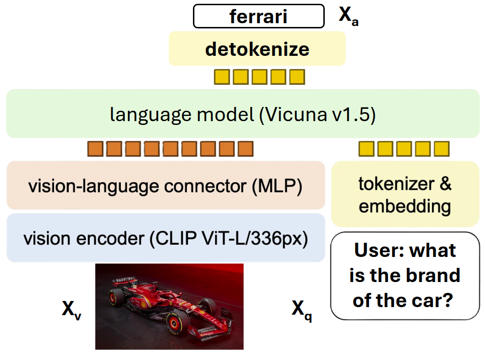

# How LLaVA Learns to See: Localizing Representation Changes in Visual Instruction Tuning

This repository contains the code and manuscript for my *Master's Degree Thesis* in **Data Science and Artificial Intelligence** at the *University of Trieste* (Academic Year 2024–2025). Special thanks to my advisors, Dr. Alberto Cazzaniga, Dr. Diego Doimo, and Dr. Lorenzo Basile for their invaluable guidance and support throughout this project.

## Description

LLaVA is a pioneering vision-language model that grounds a large language model (LLM) in images to enable multimodal assistance (see Figure). In this thesis, we investigated how visual instruction tuning reshapes the backbone's representation geometry, where along the network's depth these changes concentrate, and how they relate to downstream performance.



**Key Findings:**

- Visual instruction tuning primarily affects the LLM backbone of LLaVA in the early-mid layers, suggesting that in these layers LLaVA learns to "see" while the late layers mainly decode the next token to generate the response regardless of the input modality.
- These layers show strong geometric compression of representations, with lower intrinsic dimensionality, particularly for multimodal inputs.
- Patching these fine-tuned layers into the original LLaVA LLM backbone recovers much of the performance gain from visual instruction tuning on question answering and image captioning.
- Our results suggest targeting early-mid layers for efficient fine-tuning and adaptation of LLMs to multimodal inputs.

## Setup

First, set up the Python environment using the `uv` package manager:

```bash
bash shell/setup_environment.sh
```

This will install `uv`, create a virtual environment, and install all required dependencies.

## Repository Structure

This repository contains the code and manuscript for a master's thesis. The main components are:

- **`scripts/`** - Python scripts for various analyses and experiments
- **`shell/`** - Shell scripts to run the Python scripts with proper configurations
- **`manuscript/`** - LaTeX source files for the thesis manuscript
- **`utils/`** - Utility functions and helper modules
- **`src/`** - Core source code for representation extraction and analysis

## Usage

The Python scripts in `scripts/` can be executed using t$$he corresponding shell scripts in `shell/`. Each shell script contains pre-configured parameters and paths for running the experiments.

For example:

- `shell/residual_stream_trace_and_measures_evaluation.sh` runs `scripts/residual_stream_trace_and_measures_evaluation.py`

## Manuscript

The thesis manuscript is located in the `manuscript/` directory and contains the complete LaTeX source files for the document.

## References

[1] H. Liu, C. Li, Q. Wu, and Y. J. Lee, "Visual Instruction Tuning," *arXiv preprint arXiv:2304.08485*, 2023.

[2] H. Liu, C. Li, Y. Li, and Y. J. Lee, "Improved Baselines with Visual Instruction Tuning," *arXiv preprint arXiv:2310.03744*, 2023.
